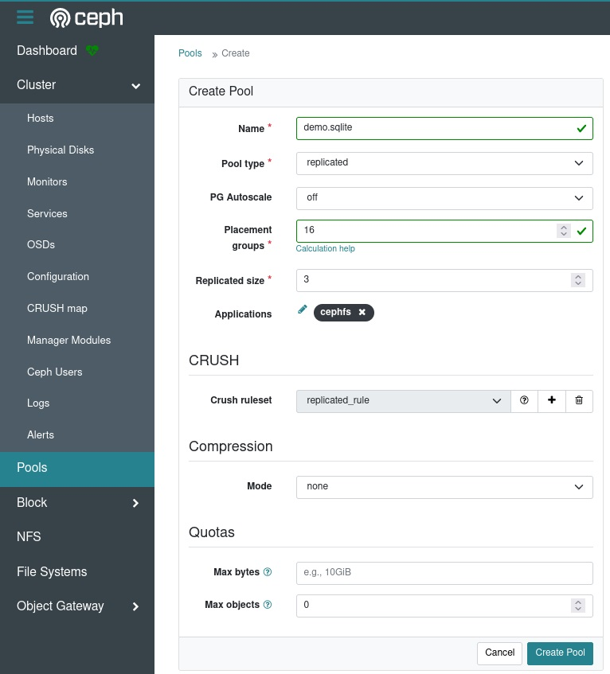
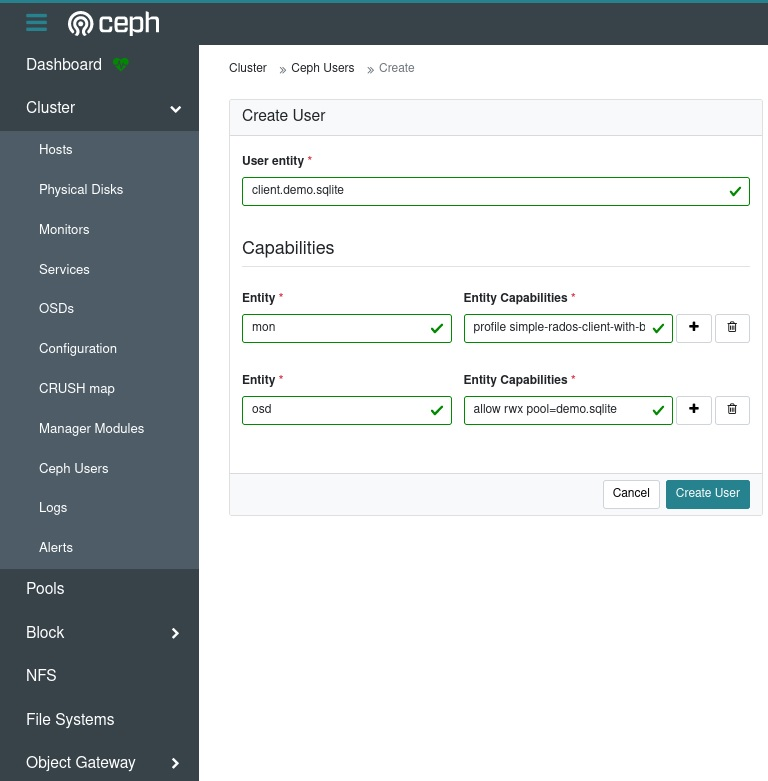
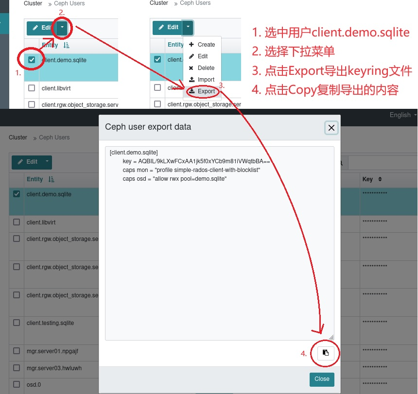

# 使用libcephsqlite.so访问Ceph提供的SQLite服务

## 前提条件

1. 一个正常运转的Ceph集群(版本大于Pacific)

2. 一台安装了RHEL系列Linux发行版并且可以访问Ceph集群的计算机作为客户端

## 演示环境

1. 一个正常运转的Ceph集群(ceph version 18.2.0 reef stable)

2. 一台安装了RHEL系列Linux发行版并且可以访问Ceph集群的计算机作为客户端

## 服务端配置(Ceph集群)

### 创建一个专用于演示的Ceph存储池

使用Ceph-Dashboard提供的WebUI来创建(安全原因: 客户端侧没有client.admin的keyring)



1. 新池的名称为 demo.sqlite

2. demo.sqlite的数据保护模式为replicated, 并且配置replicated size为3副本

3. demo.sqlite的PG配置为: 关闭PG的自动扩容, 选择16个PG即可满足Demo需求

4. demo.sqlite的Applications设置为cephfs

点击创建即可

### 创建一个专用于演示的Ceph用户

使用Ceph-Dashboard提供的WebUI来创建(安全原因: 客户端侧没有client.admin的keyring)



1. 新用户的名称为 client.demo.sqlite

2. demo.sqlite的mon权限为"profile simple-rados-client-with-blocklist" ,这个权限profile是Ceph 18.2.0官方文档里推荐Ceph SQLite VFS使用的预配置

3. demo.sqlite的mon权限为"allow rwx pool=demo.sqlite", 这个权限允许用户进行读取写入执行的权限, 并且将用户限制于刚才新创建的存储池demo.sqlite

点击创建即可

## 客户端配置

### 安装本地工具:

软件源需求: 包含需要的基础BaseOS和AppStream仓库,以及Ceph的仓库

```
[root@manager-node-114514 ~]# dnf repolist
repo id                                       repo name
appstream                                     AlmaLinux AppStream
baseos                                        AlmaLinux BaseOS
ceph-noarch                                   Ceph (noarch)
ceph-x86_64                                   Ceph (x86_64)
```

安装要用到的包: ceph sqlite libcephsqlite

```
[root@manager-node-114514 ~]# dnf install ceph sqlite libcephsqlite -y
```

### 获得Ceph的配置文件和用户密钥串

* /etc/ceph.conf(Ceph配置文件, 包含集群的链接信息等, 不包含用户验证密钥串)

  直接从Ceph集群里获取即可，从Ceph服务器的/etc/ceph.conf拷贝到本地的/etc/ceph.conf即可

* /etc/ceph/ceph.client.demo.sqlite.keyring(Ceph用户demo.sqlite的用户验证密钥串)

  可以在服务端使用'ceph auth get demo.sqlite'来获取

  此处为了更直观表达，使用Ceph-Dashboard提供的WebUI来导出这个用户的keyring文件
  
  

  步骤如下:

  1. 选中用户
 
  2. 点击下拉菜单
 
  3. 导出用户
 
  4. 拷贝Keyring内容
 
  将拷贝的内容复制到/etc/ceph/ceph.client.demo.sqlite.keyring内即可

## 开始使用
  
