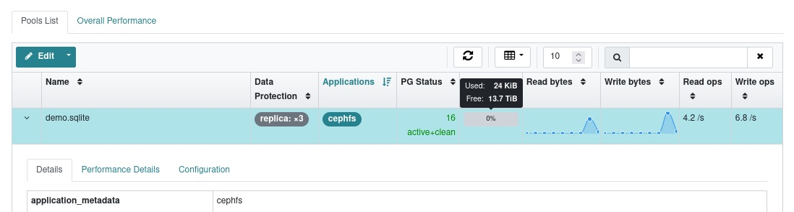

# 使用libcephsqlite.so访问Ceph提供的SQLite服务

## 前提条件

1. 一个正常运转的Ceph集群(版本大于Pacific)

2. 一台安装了RHEL系列Linux发行版并且可以访问Ceph集群的计算机作为客户端

## 演示环境

1. 一个正常运转的Ceph集群(ceph version 18.2.0 reef stable)

2. 一台安装了RHEL系列Linux发行版并且可以访问Ceph集群的计算机作为客户端

## 服务端配置(Ceph集群)

### 创建一个专用于演示的Ceph存储池

使用Ceph-Dashboard提供的WebUI来创建(安全原因: 客户端侧没有client.admin的keyring)


1. 新池的名称为 demo.sqlite

2. demo.sqlite的数据保护模式为replicated, 并且配置replicated size为3副本

3. demo.sqlite的PG配置为: 关闭PG的自动扩容, 选择16个PG即可满足Demo需求

4. demo.sqlite的Applications设置为cephfs

点击创建即可

### 创建一个专用于演示的Ceph用户

使用Ceph-Dashboard提供的WebUI来创建(安全原因: 客户端侧没有client.admin的keyring)


1. 新用户的名称为 client.demo.sqlite

2. demo.sqlite的mon权限为"profile simple-rados-client-with-blocklist" ,这个权限profile是Ceph 18.2.0官方文档里推荐Ceph SQLite VFS使用的预配置

3. demo.sqlite的mon权限为"allow rwx pool=demo.sqlite", 这个权限允许用户进行读取写入执行的权限, 并且将用户限制于刚才新创建的存储池demo.sqlite

点击创建即可

## 客户端配置

### 安装本地工具:

软件源需求: 包含需要的基础BaseOS和AppStream仓库,以及Ceph的仓库

```
[root@manager-node-114514 ~]# dnf repolist
repo id                                       repo name
appstream                                     AlmaLinux AppStream
baseos                                        AlmaLinux BaseOS
ceph-noarch                                   Ceph (noarch)
ceph-x86_64                                   Ceph (x86_64)
```

安装要用到的包: ceph sqlite libcephsqlite

```
[root@manager-node-114514 ~]# dnf install ceph sqlite libcephsqlite -y
```

### 获得Ceph的配置文件和用户密钥串

* /etc/ceph.conf(Ceph配置文件, 包含集群的链接信息等, 不包含用户验证密钥串)

  直接从Ceph集群里获取即可，从Ceph服务器的/etc/ceph.conf拷贝到本地的/etc/ceph.conf即可

* /etc/ceph/ceph.client.demo.sqlite.keyring(Ceph用户demo.sqlite的用户验证密钥串)

  可以在服务端使用'ceph auth get demo.sqlite'来获取

  此处为了更直观表达，使用Ceph-Dashboard提供的WebUI来导出这个用户的keyring文件
  
  

  步骤如下:

  1. 选中用户
 
  2. 点击下拉菜单
 
  3. 导出用户
 
  4. 拷贝Keyring内容
 
  将拷贝的内容复制到/etc/ceph/ceph.client.demo.sqlite.keyring内即可

## 开始使用
  
### 使用sqlite3工具访问数据库

先确定Ceph配置文件和用户Keyring文件都存在

```
[root@manager-node-114514 ~]# ls /etc/ceph/ceph.conf 
/etc/ceph/ceph.conf
[root@manager-node-114514 ~]# ls /etc/ceph/ceph.client.demo.sqlite.keyring 
/etc/ceph/ceph.client.demo.sqlite.keyring
[root@manager-node-114514 ~]#
```

设置环境变量

```
[root@manager-node-114514 ~]# export CEPH_CONF=/etc/ceph/ceph.conf
[root@manager-node-114514 ~]# export CEPH_KEYRING=/etc/ceph/ceph.client.demo.sqlite.keyring
[root@manager-node-114514 ~]# export CEPH_ARGS='--id demo.sqlite'
```

打开sqlite终端

```
[root@manager-node-114514 ~]# sqlite3 
SQLite version 3.34.1 2021-01-20 14:10:07
Enter ".help" for usage hints.
Connected to a transient in-memory database.
Use ".open FILENAME" to reopen on a persistent database.
sqlite>
```

令sqlite加载libcephsqlite.so库

```
sqlite> .load libcephsqlite.so
```

令sqlite加载在Ceph RADOS中的数据库文件

```
sqlite> .open file:///demo.sqlite:/database.db?vfs=ceph
```

查询Ceph自带的内容(Ceph内建性能反馈)来确保已经连接到Ceph的SQLite数据库

```
sqlite> SELECT ceph_perf();
{"libcephsqlite_vfs":{"op_open":{"avgcount":1,"sum":0.069001164,"avgtime":0.069001164},"op_delete":{"avgcount":0,"sum":0.000000000,"avgtime":0.000000000},"op_access":{"avgcount":0,"sum":0.000000000,"avgtime":0.000000000},"op_fullpathname":{"avgcount":1,"sum":0.064001080,"avgtime":0.064001080},"op_currenttime":{"avgcount":0,"sum":0.000000000,"avgtime":0.000000000},"opf_close":{"avgcount":0,"sum":0.000000000,"avgtime":0.000000000},"opf_read":{"avgcount":1,"sum":0.003000050,"avgtime":0.003000050},"opf_write":{"avgcount":0,"sum":0.000000000,"avgtime":0.000000000},"opf_truncate":{"avgcount":0,"sum":0.000000000,"avgtime":0.000000000},"opf_sync":{"avgcount":0,"sum":0.000000000,"avgtime":0.000000000},"opf_filesize":{"avgcount":0,"sum":0.000000000,"avgtime":0.000000000},"opf_lock":{"avgcount":0,"sum":0.000000000,"avgtime":0.000000000},"opf_unlock":{"avgcount":0,"sum":0.000000000,"avgtime":0.000000000},"opf_checkreservedlock":{"avgcount":0,"sum":0.000000000,"avgtime":0.000000000},"opf_filecontrol":{"avgcount":2,"sum":0.000000000,"avgtime":0.000000000},"opf_sectorsize":{"avgcount":0,"sum":0.000000000,"avgtime":0.000000000},"opf_devicecharacteristics":{"avgcount":3,"sum":0.000000000,"avgtime":0.000000000}},"libcephsqlite_striper":{"update_metadata":0,"update_allocated":0,"update_size":0,"update_version":0,"shrink":0,"shrink_bytes":0,"lock":0,"unlock":0}}
sqlite>
```

创建一个名为user的表，并且存储一些数据进去

```
sqlite> CREATE TABLE user (
    uid INTEGER PRIMARY KEY,
    name TEXT NOT NULL,
    password TEXT NOT NULL
);
sqlite> INSERT INTO user (uid, name, password) VALUES (1, 'administrator', '114514');
sqlite> INSERT INTO user (uid, name, password) VALUES (2, 'demo', '1919810');
sqlite> INSERT INTO user (uid, name, password) VALUES (3, 'default_user', 'user_password');
sqlite>
```

查询一下刚刚存储进去的数据

```
sqlite> SELECT * FROM user;
1|administrator|114514
2|demo|1919810
3|default_user|user_password
sqlite>
```

退出sqlite终端，重新连接，查看数据是否存在

```
[root@manager-node-114514 ~]# sqlite3 
SQLite version 3.34.1 2021-01-20 14:10:07
Enter ".help" for usage hints.
Connected to a transient in-memory database.
Use ".open FILENAME" to reopen on a persistent database.
sqlite> .load libcephsqlite.so
sqlite> .open file:///demo.sqlite:/database.db?vfs=ceph
sqlite> .tables
user
sqlite> SELECT * FROM user;
1|administrator|114514
2|demo|1919810
3|default_user|user_password
sqlite>
```

尝试写入大量数据并且通过Ceph 网页面板监控写入操作

写入10行数据

```
INSERT INTO user (uid, name, password) VALUES (4, 'user1', 'password1');
INSERT INTO user (uid, name, password) VALUES (5, 'user2', 'password2');
INSERT INTO user (uid, name, password) VALUES (6, 'user3', 'password3');
INSERT INTO user (uid, name, password) VALUES (7, 'user4', 'password4');
INSERT INTO user (uid, name, password) VALUES (8, 'user5', 'password5');
INSERT INTO user (uid, name, password) VALUES (9, 'user6', 'password6');
INSERT INTO user (uid, name, password) VALUES (10, 'user7', 'password7');
INSERT INTO user (uid, name, password) VALUES (11, 'user8', 'password8');
INSERT INTO user (uid, name, password) VALUES (12, 'user9', 'password9');
INSERT INTO user (uid, name, password) VALUES (13, 'user10', 'password10');
```

写入后，在Ceph网页-Pool里查看，会发现有写入数据和写入速度的波动



如此可以确定Ceph SQLite VFS提供的SQLite服务是可以正常使用的，实验成功。
