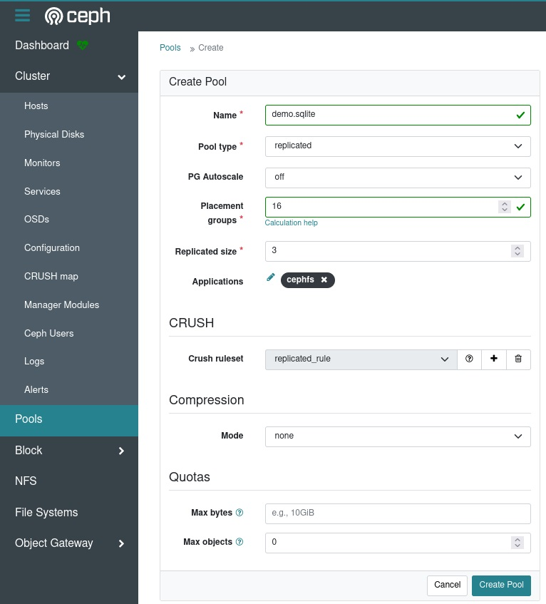
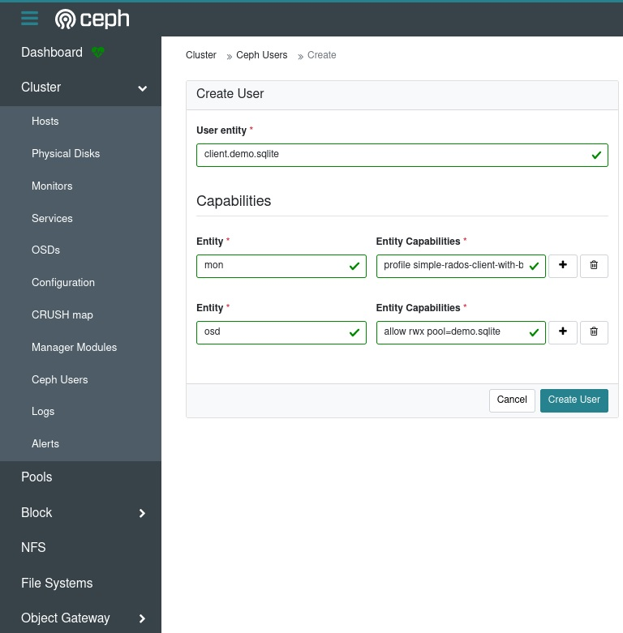

# 使用libcephsqlite.so访问Ceph提供的SQLite服务

## 前提条件

1. 一个正常运转的Ceph集群(版本大于Pacific)

2. 一台安装了RHEL系列Linux发行版并且可以访问Ceph集群的计算机作为客户端

## 演示环境

1. 一个正常运转的Ceph集群(ceph version 18.2.0 reef stable)

2. 一台安装了RHEL系列Linux发行版并且可以访问Ceph集群的计算机作为客户端

## 服务端配置(Ceph集群)

### 创建一个专用于演示的Ceph存储池

使用Ceph-Dashboard提供的WebUI来创建(安全原因: 客户端侧没有client.admin的keyring)

1. 新池的名称为 demo.sqlite

2. demo.sqlite的数据保护模式为replicated, 并且配置replicated size为3副本

3. demo.sqlite的PG配置为: 关闭PG的自动扩容, 选择16个PG即可满足Demo需求

4. demo.sqlite的Applications设置为cephfs

点击创建即可

### 创建一个专用于演示的Ceph用户

使用Ceph-Dashboard提供的WebUI来创建(安全原因: 客户端侧没有client.admin的keyring)

1. 新用户的名称为 client.demo.sqlite

2. demo.sqlite的mon权限为"profile simple-rados-client-with-blocklist" ,这个权限profile是Ceph 18.2.0官方文档里推荐Ceph SQLite VFS使用的预配置

3. demo.sqlite的mon权限为"allow rwx pool=demo.sqlite", 这个权限允许用户进行读取写入执行的权限, 并且将用户限制于刚才新创建的存储池demo.sqlite

点击创建即可
